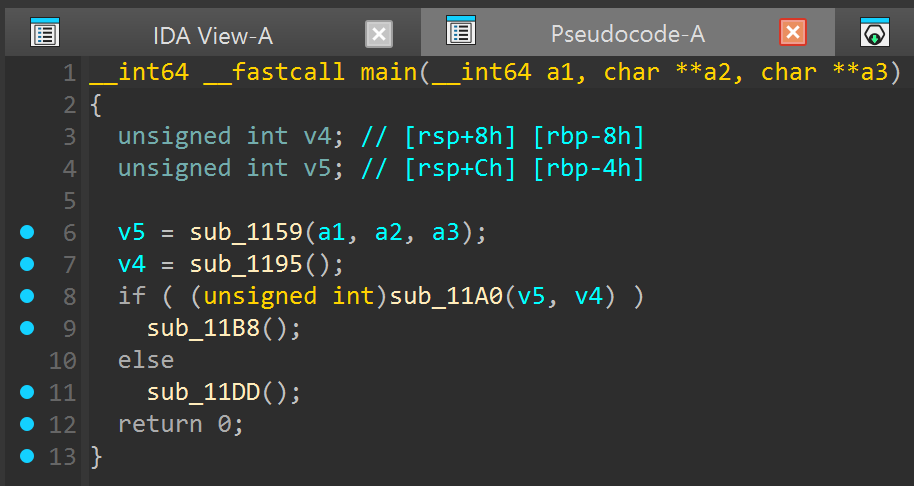
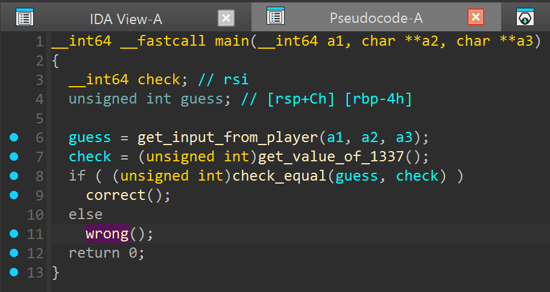
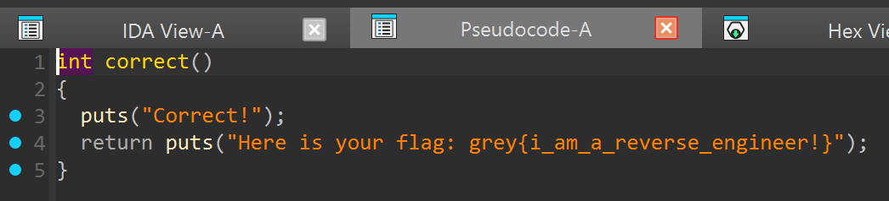
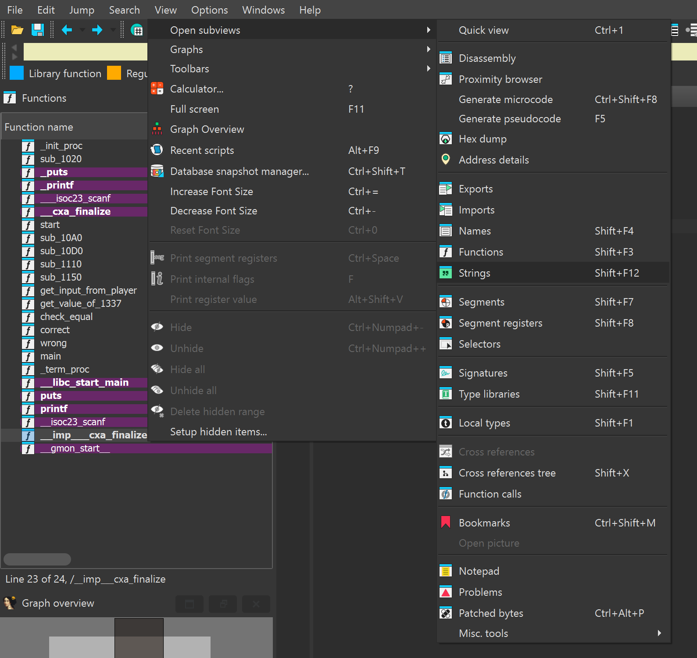
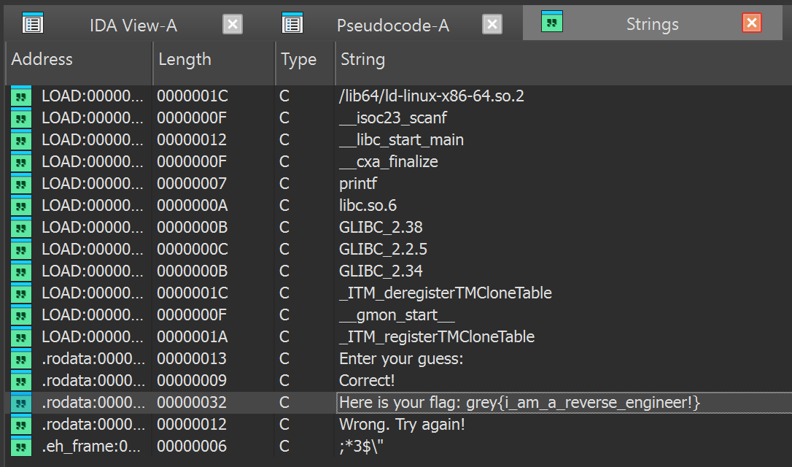

# Artifact 1

Slide numbers are correct as at 2026-01-29.

## Solution 1

We follow the instructions on slide 15, which shows us IDA's *[decompilation](https://medium.com/@pnfsoftware/what-is-decompilation-26ce48f282bc) output*.

(Note: Not explicitly mentioned, but at this stage you can just ignore all the dialogs and popups (just click Yes / OK for everything).)



If you've looked at the slides, you will realise that it *roughly* follows the Python code snippet outline, pasted here for reference:

```python
guess = get_input_from_player()
check = get_value_of_67()
if check_equal(guess, check):
    correct()
else:
    wrong()
```

You will also notice that there are some weird things that feel "off", like, why does `get_input_from_player` accept 3 arguments? Why does `main` have 3 parameters?

For the former, you could just think of it as an unfortunate case of IDA not being able to "guess" the original code correctly. But most of the time such "errors" do not affect how the program works. IDA, over many iterations, have grown to be smart enough to produce, at worst, *inconsequential* "errors" when interpreting the Assembly, especially when looking at programs originally written in simple-ish C.

For the latter, that's just how C programs work XD but again, the overall idea of the program still remains.

**One tip that** I did not manage to emphasise enough for some groups is the utility of *renaming*. By selecting a "name" (single click) and pressing `N`, we can make our code more readable based on our current understanding (see slides 11-12).



Anyway, based on what we already know about the program (or what we could roughly guess by inspecting each function), the `correct` function directly stores our flag.



To *properly* solve this challenge, we can dig around and find out that the main thing that has changed about the "essence" of this program (aside from the flag content) is the `check` value of `1337`. With that in mind, we can run the binary:

```shell
~/dist-artifact-1$ ./artifact-1.elf
Enter your guess: 1337
Correct!
Here is your flag: grey{i_am_a_reverse_engineer!}
```

## Solution 2

Referencing slide 150, strings can be a REALLY powerful clue in reverse engineering, if not at least a good starting point. There are 2 ways of looking through the available strings embedded in a binary:

1. Using IDA: (Menu bar) > `View` > `Open subviews` > `Strings` (Or Shift+F12)



A new window will pop up, and you will find the flag already there as a string.



2. Using the `strings` utility from the command line (quite handy; you can learn more about it online)

```shell
~/dist-artifact-1$ strings artifact-1.elf | grep grey{
Here is your flag: grey{i_am_a_reverse_engineer!}
```

This method is generally referred to as "cheesing", which roughly just means taking a shortcut (mostly) unintentionally left in / made available by the challenge author. I mean in this case it's somewhat intentional, but you get the point. It can be a source of quick shots of dopamine sometimes :')
