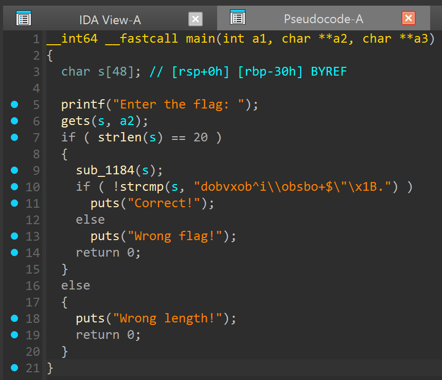
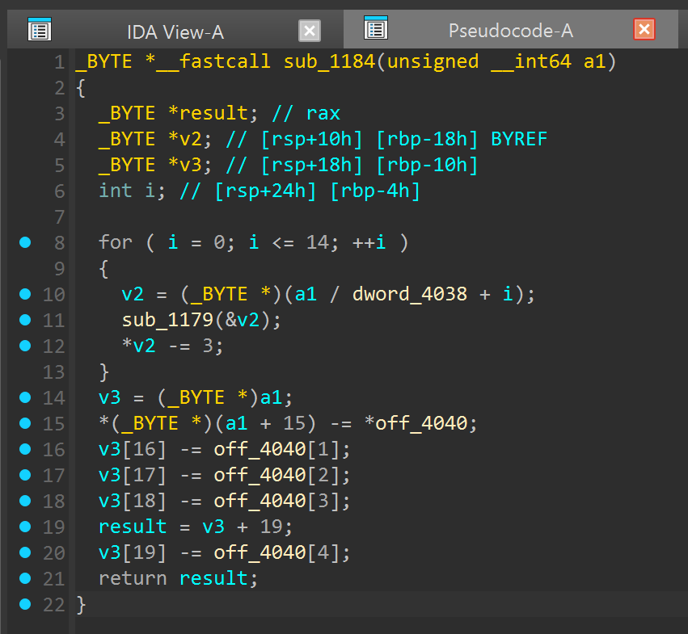
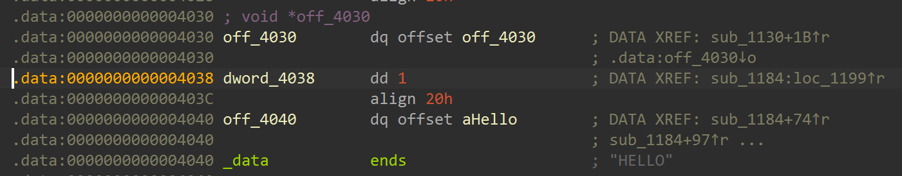
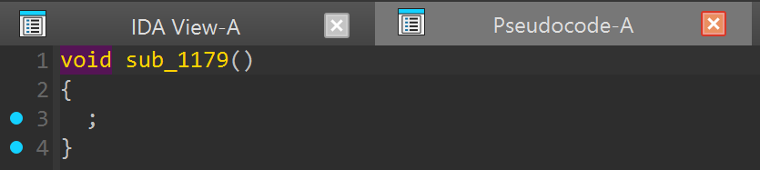
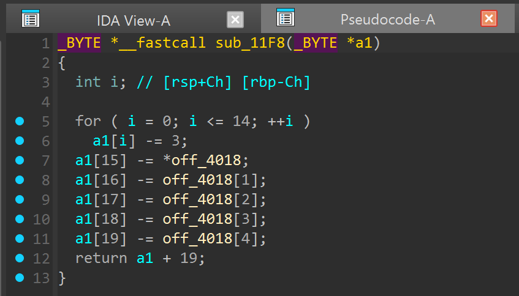
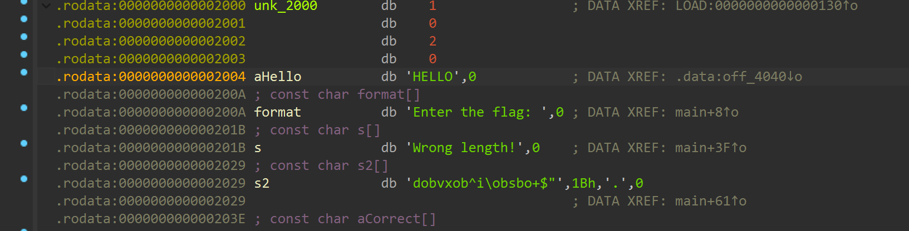
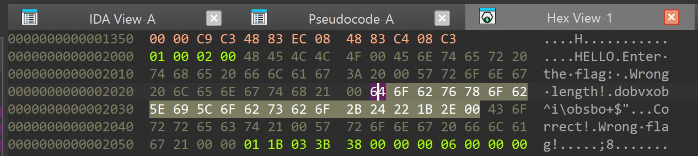

# Artifact 3

Slide numbers are correct as at 2026-01-29.

We follow the same first steps as Artifact 1.



Obviously, we will need to (at least somewhat) understand what is going on. referencing slide 143 and beyond, a quick high level glance tells us it is probably some "flag checker":

1. Program asks the user for some "flag".
2. Program does *some form of* verification on the "flag". This is deduced from the "correct" and "wrong flag" messages.
3. However, we don't receive anything aside from *learning* whether what we entered was "correct".
4. What we enter must therefore be crucial. (In this case it will literally be the flag itself.)

But how are we expected to know what to enter? Well you should actually ask the *machine* **exactly** that, hence "reverse engineering". Referencing slide 140,

> There exists some (string) input that will cause the machine to execute the "correct" branch.

---

Quick aside before we continue, notice `gets` somehow accepts 2 arguments. This is again an (inconsequential but potentially misleading) IDA "error". But we do know (from slide 115) that `gets` just gets (no pun intended) user input, and I notice most people manage to guess / deduce that the input is stored in `s`, no issue here.

In general, when encountering an unfamiliar function, **just search it up online.** 90% of the time it is less scary than you envisioned :)

---

From my rounds during training I noticed quite a few people got stuck at the `strcmp` line:

> Why is it that entering (whatever gibberish the second argument is) as my input doesn't work, even though the program is literally comparing them for equality?

The key lines in this line:

```c
    sub_1184(s);
```

As an illustration: (the comments are example "values of s")

```c
__int64 __fastcall main(int a1, char **a2, char **a3)
{
  char s[48];

  printf("Enter the flag: ");
  gets(s, a2);                  // s = "aaaabbbbccccddddeeee"
  if ( strlen(s) == 20 )
  {
    sub_1184(s);                // s = "ffffgggghhhhiiiijjjj"
    if ( !strcmp(s, "dobvxob^i\\obsbo+$\"\x1B.") )
      puts("Correct!");
    else
      puts("Wrong flag!");
    return 0;
  }
  else
  {
    puts("Wrong length!");
    return 0;
  }
}
```

That is, the string `s` got *modified* within `sub_1184`. You could perhaps name the function `tweak_the_input`. Which is to say, even if you entered `dobvxob^i\\obsbo+$\"\x1B.` for your `s`, it will get modified to something else, failing the check.

This is actually the crux of the program. Given the correct flag (in this case `grey{...}`), `sub_1184` *modifies* it to look like `dobvxob^i\\obsbo+$\"\x1B.`, which is then compared. If you know cryptography, ciphers might come into your mind. It has the same general idea. (Or lowkey even hashes.)

Using a (hopefuly) simpler analogy:

> I (the program) asks you (the user) for a number.
>
> I subtract 3 from that number.
>
> I tell you that I don't like the number, because it's not 67.
>
> You realise that you must tell me 70, such that after subtracting 3, it becomes 67.

Reverse engineering!

---

Enough blabber, let's examine how `tweak_the_input` works.



**SCARY!**

First step. What are `dword_4038`, `sub_1179` and `off_4040`? I believe IDA colours them the same for all 3 colour schemes. My colour scheme (dark) uses a quite inviting yellow, so we can double click on each of them to inspect further.





Cut to the chase, `dword_4038` is just `1` (where dividing by 1 does nothing), and `sub_1179` *quite literally* does nothing (empty function).

**For context,** I placed these in to try to confuse IDA, otherwise it will immediately guess what the code in the `for` loop is doing and there wouldn't be much reversing.

(I later realised it might actually have been better as I needed to reduce the difficulty for the training, so if you've seen `artifact-3a` that's what it looks like without the 2 dummies.)



Either way, the former decompilation can be "derived" from the former decompilation. I don't think you can directly edit the IDA output, but what I sometimes do is to literally paste the output into an editor and clean it up from there. So with

```c
    tmp = (_BYTE *)(input / 1 + i);
    do_nothing(&tmp);
    *tmp -= 3;
```

Clean up the noise:

```c
    tmp = (_BYTE *)(input + i);
    *tmp -= 3;
```

Then referencing slides 104 / 110 / 111 (understandably that portion was super difficult to swallow during training, hence the reduced difficulty in `artifact-3a`):

```c
  input[i] -= 3;
```

NOW HOLD ON, what are you doing, subtracting from a string!?!?

Slide 154 :) Or, basically what the entire section from slide 86 to 111 is trying to say.

I will say it again: STRINGS ARE FAKE AND DON'T EXIST.

> The machine reads a number (e.g. 65).
>
> We (the code) tell the machine, no, this *particular* 65 is *not* 65. If you think it's 65, you are wrong. 65 means 'A'.
>
> That's the basis for strings.

If you're still stuck somewhere, you can search up a video on ASCII or how computers represent letters in general. Or you're more than welcome to open a ticket and ask me more :D

Now, what about `off_4040`? We've seen from above that it references some weird `aHello`. Inspecting further leads us to:



It is another string! Indexed one by one they are *characters*, so we are subtracting a character from a character. how fun :sweat_smile:

You can also see our final "target string" in the view. But this time it is represented a bit differently. Why is there a random `1Bh` in my string :(

As I hopefully have mentioned during training (apologies if I didn't), IDA can't display every possible string "directly" (due to escaping and stuff, if you know what that means). The most reliable way is to look at how it *actually looks like* in the binary:



This is done by opening "Hex View-1" (which is automatically synced to "IDA View-A"). You can also see the byte representation of `HELLO` slightly above.

The remainder is just Mathematics, like idk, a piece of homework.

```
input byte:  0  1  2  3  4  5  6  7  8  9 10 11 12 13 14
            ?? ?? ?? ?? ?? ?? ?? ?? ?? ?? ?? ?? ?? ?? ??
sub_1184:   -3 -3 -3 -3 -3 -3 -3 -3 -3 -3 -3 -3 -3 -3 -3
────────────────────────────────────────────────────────
(strcmp)    64 6F 62 76 78 6F 62 5E 69 5C 6F 62 73 62 6F
```

Last 5 bytes, because I ran out of space:

```
input byte:  15  16  17  18  19
             ??  ??  ??  ??  ??
sub_1184:   -48 -45 -4C -4C -4F
───────────────────────────────
(strcmp)     2B  24  22  1B  2E
```

Or, if you really hate hexadecimal:

```
input byte: [0] [1] [2] [3] [4] [5] [6] [7] [8] [9] [10][11][12][13][14]
             ??  ??  ??  ??  ??  ??  ??  ??  ??  ??  ??  ??  ??  ??  ??
sub_1184:    -3  -3  -3  -3  -3  -3  -3  -3  -3  -3  -3  -3  -3  -3  -3
───────────────────────────────────────────────────────────────────────
(strcmp)    100 111  98 118 120 111  98  94 105  92 111  98 115  98 111
```

```
input byte: [15][16][17][18][19]
             ??  ??  ??  ??  ??
sub_1184:   -72 -69 -76 -76 -79
───────────────────────────────
(strcmp)     43  36  34  27  46
```

Repetitive tasks are annoying, but this is where scripts (like Python) generally shine.

```python
# working backwords, this is actually the "final state" of our input
FLAG = [0x64, 0x6F, 0x62, 0x76, 0x78, 0x6F, 0x62, 0x5E, 0x69, 0x5C, 0x6F, 0x62, 0x73, 0x62, 0x6F, 0x2B, 0x24, 0x22, 0x1B, 0x2E]
for i in range(15):
    FLAG[i] += 3

HELLO = [0x48, 0x45, 0x4C, 0x4C, 0x4F]
for i in range(5):
    FLAG[15+i] += HELLO[i]

# python shortcut :) or you can dump into cyberchef
print(bytes(FLAG).decode())
```

(If you again hate hexadecimal, using their decimal counterparts doesn't make a difference in the script. They are the same number; Python sees `0x` as an indication of hexadecimal *representation*.)

```
grey{real_reversing}
```
