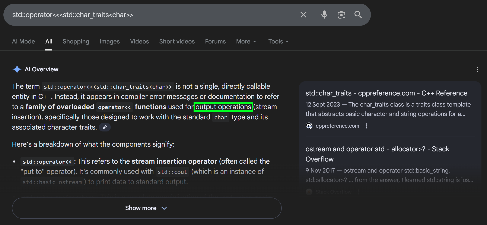
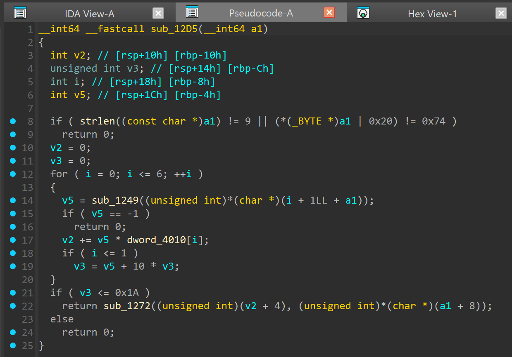
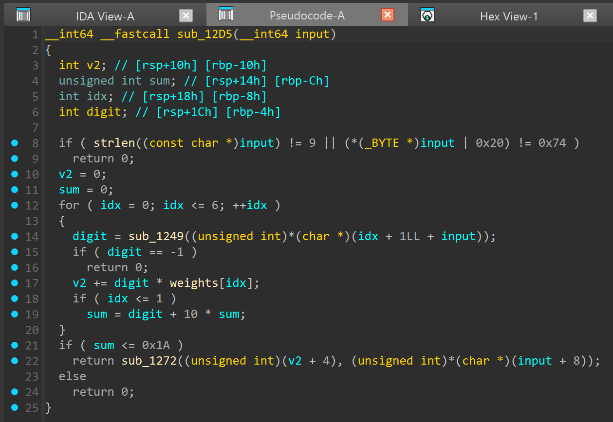
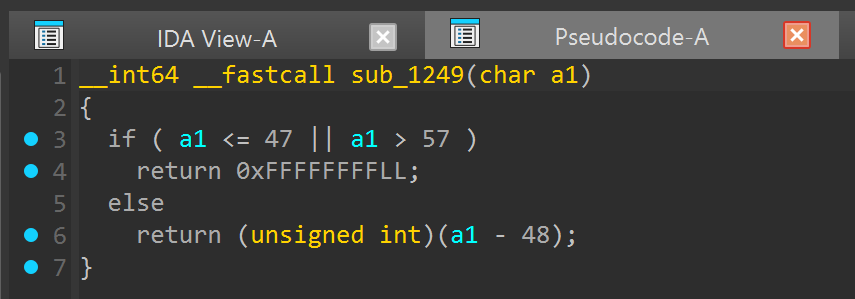
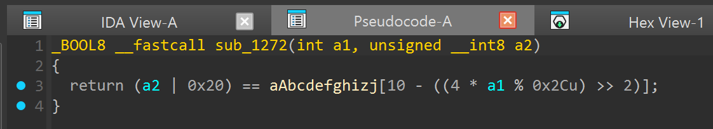
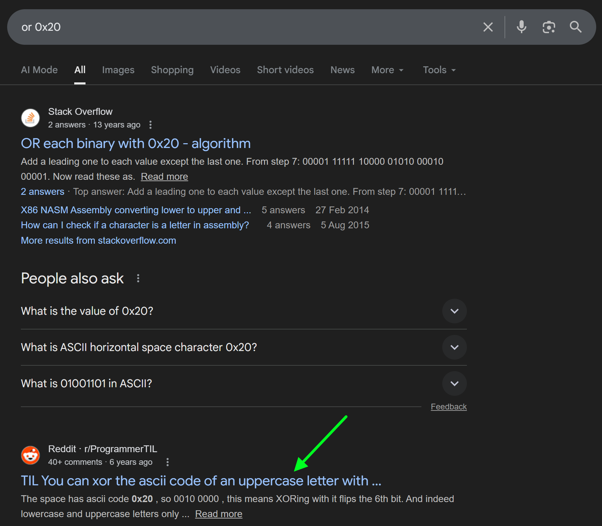
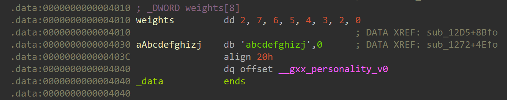
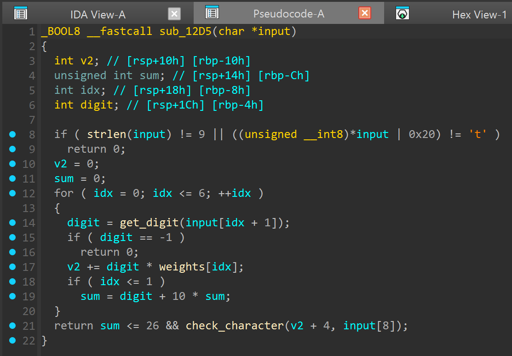

# Artifact 5

We assume some familiarity with looking at decompilations and stuff. (If not, do revisit artifacts 1 and 3; I believe 11 and 13 help as well)

Our `main` function looks very scary this time!


This is completely intended; part of the goal is the ability to deal with some level of "noise". I am defining "noise" very loosely here; you can think of it as a piece of code which actually does a very simple "thing" but is written in a very verbose manner.

Staring at it slightly longer, we realise the "noise" primarily come from the weird function names. To prove this, let's rename them to what they *roughly* do (simplified for demonstration purposes):


SO MUCH better!

By the way, the "noise" is really just C++. If you know C++, you can stare at some of the function names and realise they look kind of familiar.

The point is, do try to fight the initial repulsion upon seeing unfamiliar and verbose code. Quite often it is not too horrible to deal with. (Exceptions exist, e.g. Rust, you just have to power through it I guess :/)

Especially in this example, starting from our initial decompilation (above), the strings are a REALLY helpful guide in telling us what's going on -- based on what we have seen so far, more likely than not all those `abc::def<<pqr>>xyz` stuff deal with input and output (I/O).

With this suspicion, the next step is to... just look it up online.



The AI overview is such a cheat code these days. Last time you would have to skim through 1-3 articles to get a good picture. (Well you would still need to if the AI overview is not comprehensive enough XD)

But of course sometimes you *still* don't understand something even after searching up and down for information (I sometimes do as well). One valid option is to just ignore it and pray that it doesn't come back to bite you. (If you later realise something *really* doesn't add up, then you could perhaps force yourself to revisit the thing that you skipped.)

---

Be it through educated guessing or painstakingly understanding each function, you eventually arrive at a mental model somewhat similar to the "cleaned up" decompilation. It looks roughly similar to some sort of checker again, this time requiring a "serial number". All the checks for the input seem to be done in one function, `sub_12D5`. Let's examine that.



Another piece of mess. This time round it's different but somewhat similar, they are still primarily caused by unexplainable "symbols" (names for functions and data).

Based on the general methodology of looking at these things, we can first have a first pass of what these variables seem to be doing.



Wait, that was too fast! Okay, let me give some justifications:

- `input` is quite obvious, we already know that from `main`.
- `idx` is quite obvious as well, IDA managed to detect a `for`-loop.
- Where did `digit` and `sum` come from? My "educated guess" primarily came from this line:

```c
      sum = digit + 10 * sum;
```

Maybe it's because I've seen too much of these sort of constructs that I just automatically pattern matched it. If you've taken an algorithms class (just a simple one should do?), you will remember this is one way to "construct" an n-digit number from its individual digits.

But if you're unsure, you can maybe add a ? to their names and revisit later with more information; leaving them "uninterpreted" is fine too. (I guess you can't directly append a `?` in the name, so any sort of marking will do.)

Finally, `weights` because it seems to be an array of small integers which are used in this way on this line:

```c
    v2 += digit * weights[idx];
```

Which kind of makes sense.

---

To complete our interpreting, we have 2 more functions to go:



If you know your ASCII, this just gives you the *numeric* representation (value) of each ASCII "number" character (0123456789), or `-1` if not a "number" character. (Sort of like string to int but for 1 digit.)



This is a bit more contrived and requries a bit more work.

Immediately we see an equality comparison `==`; the LHS is parameter 2 `or`-ed with `0x20`. Cut to the chase, this is a common construct in bitwise operations which converts an English letter to its *lowercase* form. Don't believe me?



Going back to the caller, our 2nd argument is `(unsigned int)*(char *)(input + 8)`; ignoring the casting, it somewhat looks like `input[8]`. (Sometimes it's okay to leave things at a "strong suspicion", but you can always stare at it longer to confirm things if you feel like.)

Now what about the RHS? `aAbcdefghizj` is, in fact, just a string:



Which is 11 characters long; the data after the string don't seem to be very useful, so either `a1` is maximally `10`, or the code in the `[ ]` forces the expression to be maximally `10`. We shall work this out step by step:

```
(x is a1)
10 - ((4 * x % 0x2Cu) >> 2)
10 - ((4 * x % 44) >> 2)      decimal might be easier for math stuff
10 - ((4 * x % 44) / 4)       again a bitwise operation
10 - (x % 11)                 by plugging in some simple values for x
```

Ultimately, figuring out exactly how `x` (or `a1`) maps to the character in `aAbcdefghizj` is not *crucial* **at this stage**. We just need to roughly know that `a1` gets mapped to *some* character (for now).

---

We return to the caller to complete the picture. We could do some more minor cleanup ourselves and arrive at:



**Optional, but** some tricks I've employed:

- Sometimes the *guessed type* matters. You can change it by pressing `Y` (similar to renaming with `N`). In this case I changed `input` to `char *`.
- Toggle through different representations of a value to see which one fits the best in our context. Right click on the value to try. Note the `'t'` in the first `if` as well as the `26` on the last line.
- Again, you could always just dump IDA's output and do some manual cleanup yourself. Or even convert it to a whole nother language (I use Python sometimes).

Anyway, we actually have enough information to guess the structure of our input. From the first line, last line, and the `get_digit` call, we have:

```
T#######X
```

Where `#` is *some number*, `X` is *some (valid) letter*, and the letters are case-insensitive.

If you've guessed the scheme, congratulations! You can *quite literally* solve the challenge now (read the description). But for those unconvinced, let's look further at the loop.

Firstly, the `sum`. As mentioned, it gradually gets built up from individual digits. Since only `idx = 0` or `idx = 1` contributes to the sum, it will be a 2 digit number based on the first 2 digits of our input. This `sum` needs to be at most `26`. So from `T00#####X` to `T26#####X`. Hmm.

Next, `v2`. The `weights` naming does make it clearer; each constituent digit of our input is multiplied by some small integer weight and added to, oops, another sum. Maybe we can name it `real_sum`. This `real_sum` is used as `a1` for our `check_character` function, i.e. the final letter of our input is fully derived from `a1`, which it itself fully derived from the digits. Hmm.

Yea, hopefully it is clear by now. If STILL unconvinced for whatever reason, try using your birth year as the first 2 digits, then idk, whatever 5 digit sequence you can think of that runs off from what you've already entered. Or maybe you're just an unc with a serial code starting with `S99` or something, in which case I apologise.

If you **STILL** can't get it, don't be ashamed, do open a ticket :P

(To be very fair, this algorithm is not exactly very publicised, for good reason.)
